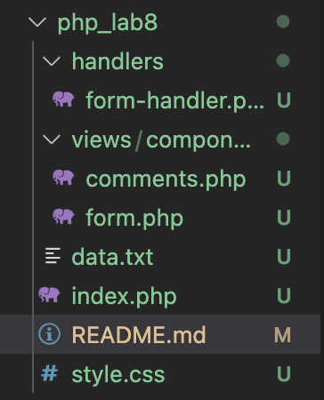
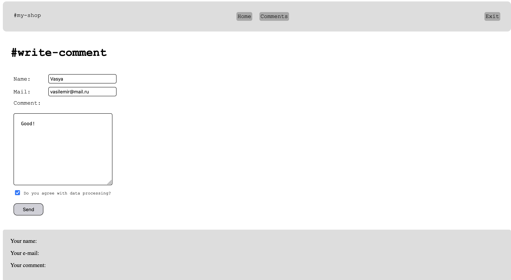
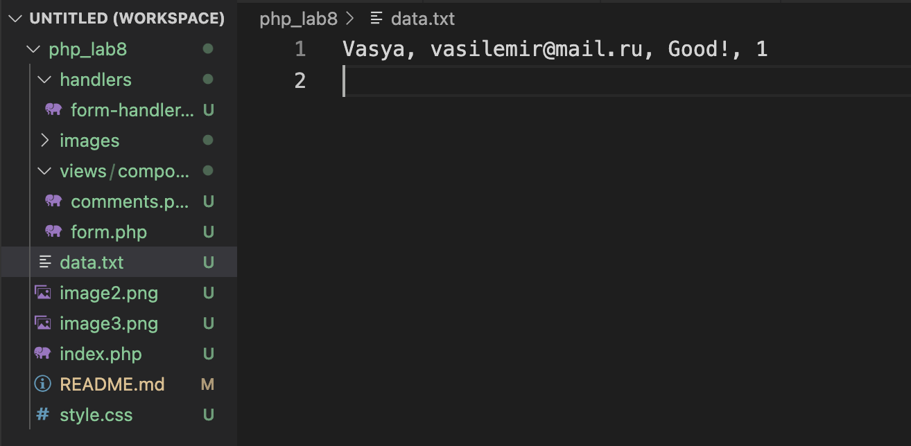

# Лабораторная работа №8

### За основу лабораторной работы была взята форма из [четвертой лабораторной работы.](https://github.com/procuratura-dev/php_lab4) и переделана по этим требованиям:

1. Создайте директорию /views, в которой будут находиться все ваши представления (шаблоны).
2. Внутри директории /views создайте поддиректорию /components, где будут содержаться компоненты ваших страниц.
3. В главной директории проекта создайте файл index.php, в котором определите основную структуру вашей страницы (header, main, footer).
```php
    <header>
        <div style="margin: 10px;">
            #my-shop
        </div>
        <div class="header_mid">
            <div class="blocks">Home</div>
            <div class="blocks">Comments</div>
        </div>
        <div class="blocks">Exit</div>
    </header>
    
    <main>
    <?php include 'handlers/form-handler.php';?>
    <?php include 'views/components/form.php';?>
    </main>

    <footer>
    <?php include 'views/components/comments.php';?>
    </footer>
```
4. В поддиректории /components создайте файл form.php, который будет определять форму для комментариев (с минимум двумя полями).
```php
<form method="post">
        <fieldset>
            <legend>
                <h1>#write-comment</h1>
            </legend>
            <?php displayFormField("name", "Name", $name, $errors[1]); ?>
            <?php displayFormField("mail", "Mail", $mail, $errors[2]); ?>
            <div class="e_form">
                <label for="comment">Comment:<br><br>
                    <textarea name="comment" id="comment" cols="30" rows="10"><?php echo $comment; ?></textarea>
                    <?php echo $errors[3]; ?>
                </label>
            </div>
            <div style="margin: 10px; font-size: 12px">
                <input type="checkbox" name="agree" id="agree" <?php echo $agree ? 'checked' : ''; ?>>
                <label for="agree">Do you agree with data processing?</label>
                <?php echo $errors[4]; ?>
            </div>
            <div class="submit">
                <input type="submit" value="Send">
            </div>
        </fieldset>
    </form>
```
5. Создайте директорию /handlers, где будете хранить файлы для обработки форм.
```php
<?php
    $name = $mail = $comment = $agree = '';
    $errors = [];

    if ($_SERVER["REQUEST_METHOD"] == "POST") {
        $name = $_POST["name"];
        $mail = $_POST["mail"];
        $comment = $_POST["comment"];
        $agree = isset($_POST["agree"]);

        $errors = validateForm($name, $mail, $comment, $agree);
    }

    function validateForm($name, $mail, $comment, $agree)
    {
        $errors = [];

        if (strlen($name) < 3 || strlen($name) > 20 || preg_match("/\d/", $name)) {
            $errors[1] = "Invalid name. It should be 3-20 characters long and contain no digits.";
        }

        if (!filter_var($mail, FILTER_VALIDATE_EMAIL)) {
            $errors[2] = "Invalid email address.";
        }

        if (empty($comment)) {
            $errors[3] = "Comment cannot be empty.";
        }

        if (!$agree) {
            $errors[4] = "You must agree with data processing.";
        }

        return $errors;
    }

    if (empty($errors)){
        $data = [$name,", ", $mail,", ", $comment,", ", $agree, "\n"];
        file_put_contents("data.txt", $data, FILE_APPEND);
    }
    ?>

<?php
function displayFormField($name, $label, $value, $error)
{
    ?>
    <div class="e_form">
        <label for="<?php echo $name; ?>"><?php echo $label; ?>:
            <input type="text" name="<?php echo $name; ?>" value="<?php echo $value; ?>">
            <?php echo $error; ?>
        </label>
    </div>
    <?php
}
?>
```
6. В директории /handlers создайте файл form-handler.php, содержащий логику сохранения данных формы в файл.
```php
    if (empty($errors)){
        $data = [$name,", ", $mail,", ", $comment,", ", $agree, "\n"];
        file_put_contents("data.txt", $data, FILE_APPEND);
    }
```
7. В поддиректории /components создайте файл comments.php, который будет отображать сохраненные комментарии.
```php
<?php
    if (empty($errors)) {
    ?>
        <div id="result" class="comment-result">
            <p>Your name: <b><?php echo $name ?></b></p>
            <p>Your e-mail: <b><?php echo $mail ?></b></p>
            <p>Your comment: <b><?php echo $comment ?></b></p>
        </div>
    <?php
    }
?>
```
8. Используя инструкции include и require, соедините все файлы в index.php.
9. По необходимости добавьте другие файлы, например, файлы с дополнительными функциями в /handlers/functions.php.

Структура проекта:



Выполние:




